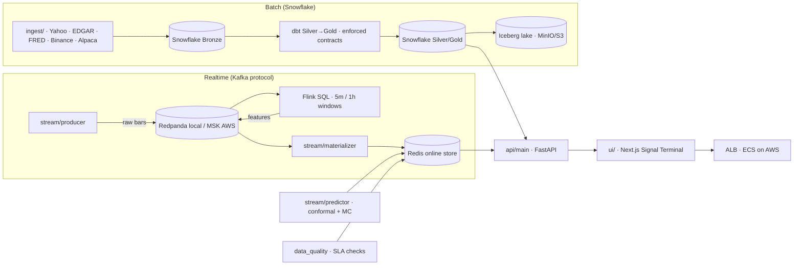

# quant signal

Production-grade quant signal platform - **Snowflake-backed batch pipelines**,
a **Kafka → Flink → Redis realtime layer**, research-driven model validation,
and data quality enforced at every stage.

It ends in a **live market-neutral book placing real orders on a demo venue**,
and the part most platforms cannot demonstrate — a **deploy gate that proves
the live system is running the strategy that was validated**: 0 direction
mismatches across 4,480 checks, look-ahead leak of 0.00e+00 on every factor,
and live feeds reconciled to the research caches at 0.000e+00.

**Status:** full build, running locally and deployed to AWS via Terraform.

---

## Table of contents

1. [Build log](#build-log)
2. [Architecture](#architecture)
3. [Key capabilities](#key-capabilities)
4. [Data infrastructure: storage, transport, failure modes](#data-infrastructure-storage-transport-and-failure-modes)
5. [Two strategies, one execution path](#two-strategies-one-execution-path)
6. [Research ↔ production parity](#research--production-parity)
7. [Technology stack](#technology-stack)
8. [Repository layout](#repository-layout)
9. [Getting started](#getting-started)
10. [Local runbook](#local-runbook)
11. [AWS deployment](#aws-deployment)
12. [Continuous integration](#continuous-integration)
13. [Design principles](#design-principles)
14. [Notes & references](#notes--references)

---

## Build log

| Build | What | Delivered |
|---|---|---|
| **#1** | Autonomous research harness | Offline config sweep → MLflow → per-symbol leaderboards in Redis, read by the live predictor (`stream/research_harness.py`, `make stream-research`) |
| **#2** | Data quality / SLA layer | 8 quality dimensions + lineage manifest per window, served at `/api/market/quality` (`stream/data_quality.py`, `make stream-quality`) |
| **#3** | AWS IaC + CI + docs | MSK → Flink-on-Fargate → ElastiCache → ECS agents + UI behind an ALB; CloudWatch alarms + SNS; remote state; CI with `terraform fmt`/`validate` |
| **#4** | Data lake (Iceberg) | The Snowflake mart is versioned to an Apache Iceberg table on S3-compatible storage (MinIO locally, real S3 on AWS) with snapshot history / time travel (`flows/lake_export.py`, `make lake-export` / `lake-query`) |
| **#5** | Live strategy path + feed reconciliation | A market-neutral weekly book (SRP) trading real orders on a demo venue, fed by two new keyless feeds (`stream/intraday_feed.py`, `stream/positioning_feed.py`) that were **reconciled field-by-field against the research caches to 0.000e+00** before being trusted (`stream/srp_live.py`) |
| **#6** | Research↔production parity gate + trial registry | A deploy gate that fails the **build** rather than the P&L when live and research disagree (`scripts/srp_parity.py`), plus an append-only experiment registry so multiple-testing corrections read a measured trial count instead of a remembered one (`scripts/trial_registry.py`) |

Every credential and threshold comes from the environment — nothing hardcoded.

---

## Architecture



The realtime feature pipeline, end to end:

```
Binance producer → Redpanda (crypto.bars.raw) → Flink SQL 5m/1h TUMBLE windows
   → Redpanda (crypto.features.*) → materializer → Redis online store → /api/market/*
```

The API reads from Redis (<500 ms, never touching Kafka or Snowflake); a stream
watchdog auto-heals a stalled Flink pipeline and a pipeline-health strip keeps
the dashboard honest about what is actually fresh.

### Who actually produces each topic

Two producers feed the feature bus, and knowing which is which matters — a
topic that is *fresh* is not necessarily fresh *from the source you assume*.
Verified by consuming each topic and checking the VWAP signature (Flink computes
a true volume-weighted price; the feed publishes a typical price):

| Topic | Producer | State |
|---|---|---|
| `crypto.bars.raw` | `stream/producer` | live — 1-min venue bars |
| `crypto.features.5m` | **Flink SQL** | live — volume-weighted VWAP |
| `crypto.features.1h` | **`stream/feature_feed.py`** | live — 20/20 sampled messages carry the feed's signature, none Flink's |

**The hourly path bypasses Flink**, and that was a deliberate response to a real
outage. The 1h river stalled while every process still reported healthy: nothing
crashed, no error was logged, and the dashboard rendered a `window_end`
**312 days** in the past. A pipeline producing nothing looks identical to one
that is merely quiet.

`stream/feature_feed.py` is therefore the hourly upstream: it fetches completed
1h bars from the venue's keyless public endpoint and publishes them to
`crypto.features.1h` in the **exact Flink schema**, field for field, so every
downstream consumer runs unchanged. Flink continues to serve the 5-minute
windows. Two defences were added at the same time:

- a **staleness guard** in the signal path, so a bar whose `window_end` is older
  than a bounded age can never trigger a rebalance;
- **per-symbol venue-category discovery** — `BTCUSDT` exists as both spot and
  linear perp while `RLCUSDT`/`STORJUSDT`/`XMRUSDT` are perp-only, so hardcoding
  either choice starves half the universe (measured: 1 of 6 test symbols
  fetching). The category is discovered on first use and remembered.

The generalisable lesson: **liveness has to be asserted against a clock, not
inferred from the absence of errors** — and "which producer wrote this?" is a
question worth being able to answer, which is why the table above was verified
by inspecting message contents rather than by trusting the architecture diagram.

---

## Key capabilities

- **Batch (Snowflake).** Idempotent bootstrap (database, warehouse, schemas,
  least-privilege roles), real ingestion (Yahoo / SEC EDGAR / FRED / Binance /
  Alpaca) into Bronze→Silver→Gold with latency telemetry, and dbt with
  enforced column contracts (`make bootstrap`, `make dbt-run`).
- **Realtime.** Redpanda (Kafka API) → Flink SQL event-time windows → Redis
  online store; the same broker protocol runs on AWS MSK.
- **Online prediction (the first approach).** River online learner with conformal
  intervals + Monte Carlo simulation; a **promotion gate** (progressive
  validation + Deflated Sharpe) decides honestly whether a model may trade.
  It still runs — but it is no longer what trades. See below.
- **Systematic factor strategy (what trades today).** A market-neutral weekly
  long/short book over ~112 perpetuals, built from eleven factors and validated
  out-of-sample before deployment.
- **Research harness.** Hyperparameters are swept, tracked to MLflow, and
  leaderboarded — not guessed.
- **Data quality.** 8 dimensions + lineage, scored per symbol/window and served
  over the API.
- **Data lake (Iceberg).** The mart is versioned to an open-table-format lake
  (MinIO local / S3 AWS) with snapshot history and time travel
  (`make lake-export`).
- **Observability.** Per-stage freshness, self-healing watchdog, and (on AWS)
  CloudWatch alarms + SNS + a platform dashboard.
- **Signal Terminal.** Next.js dashboard rendering the full MC visualization
  stack (forward fan, equity fan, pass-probability landscape, drawdown/terminal
  distributions).

### Data infrastructure: storage, transport, and failure modes

Two pipelines feed the strategy, and they are engineered to different contracts.

**Offline path — builds history, optimised for completeness.**

```
data.binance.vision (bulk archive)  +  keyless Binance/Bybit REST
   │
   ├─ scripts/backfill/backfill_ohlcv.py ────────→ hourly bars, resampled to weekly
   ├─ scripts/backfill_intraday_features.py ────→ 1h AND 5m klines reduced to ONE
   │                                               record per UTC day
   └─ scripts/backfill/backfill_positioning.py ─→ futures metrics (open interest,
                                                   long/short ratios), daily
```

**Online path — extends that history, optimised for freshness.**

```
Bybit keyless REST → stream/feature_feed.py → Kafka (crypto.features.1h)
                                                 │
   stream/asym_signal.py ◄────────────────────────┘   consumes the bus,
      │                                                maintains a weekly registry
      └─ stream/srp_live.py ── seeds from the offline caches, appends live via
                               intraday_feed.py + positioning_feed.py
                                                 │
   Redis (prediction:crypto:asym:1h) ◄───────────┘
      │
   stream/execution.py + bybit_demo.py → REAL orders (maker-first, market fallback)
      │
   Redis (execution:crypto:1h) → FastAPI :8000 → Next.js :3000
```

**Why each store.** The feature bus is **Kafka** because it is a replayable log —
a consumer can be restarted and re-read from an offset, which matters when the
signal daemon crashes mid-window. The signal→execution handoff is **Redis**
because execution needs the *current* target, not the history; a key-value read
is the right primitive and keeps the API under 500 ms without touching Kafka or
the warehouse. **Snowflake and the Iceberg lake are not in the crypto trading
path at all** — they serve the batch/equities side (Yahoo, EDGAR, FRED, Alpaca).

**The seed-and-extend problem.** Live REST surfaces expose roughly 30 days of
positioning history; the strategy needs 52 weeks of trailing data per symbol. So
live history is *seeded* from the offline caches and extended forward. That join
is only sound if both sources measure the same quantity, which was verified
rather than assumed — **0.000e+00 across 7 fields over 26 days.** Reaching that
number required fixing two real defects:

| Defect | Why it was invisible | Fix |
|---|---|---|
| Partial-day bars | the current day always has fewer bars than a complete one, so the reduction silently differed between live and research | require a full bar count per interval before emitting a day |
| REST/archive timestamp offset | REST stamps a window at its **end**; the bulk archive labels by occurrence — a clean one-period shift that looked like plausible data | subtract one period on the REST path |

**Failure modes this pipeline is built against**, each learned from an outage:

- **Silent starvation.** A producer that stops writing looks exactly like a quiet
  market. Liveness is asserted against a wall clock — a bar older than a bounded
  age cannot trigger a rebalance, and staleness is surfaced on a health strip
  rather than inferred from an absence of errors.
- **Wrong-venue lookups.** `BTCUSDT` exists as both spot and linear perp;
  `RLCUSDT`, `STORJUSDT` and `XMRUSDT` are perp-only. Hardcoding either category
  starved the universe (measured: 1 of 6 symbols fetching). Category is now
  **discovered per symbol** on first use and cached.
- **State latched on failure.** A transient all-FLAT selection once froze the
  book for a full week because the failure was latched as if it were a decision.
  Only a non-FLAT selection is now latched.
- **Throughput mistaken for breakage.** A 76-symbol book filling alphabetically
  looks stalled. Poll budgets are configurable rather than fixed (19 min → 5 min
  for a full cycle), and partial fills are reported as progress, not failure.

**Deployment.** Locally the daemons run under **launchd** (`com.quantsignal.*`),
each with its own environment and restart policy. On AWS the same processes run
as **ECS Fargate** services against **MSK** and **ElastiCache**, defined in
Terraform with remote state.

### Two strategies, one execution path

The platform started by trying to **predict returns** with an online learner, and
now trades a **systematic factor strategy** instead. Both still run; only one
places orders, and which one is a single environment variable:

```
stream/predictor.py    River online learner  → prediction:crypto:1h:*        (102 keys)
stream/asym_signal.py  SRP factor strategy   → prediction:crypto:asym:1h:*   (105 keys)
                                                        │
                            STREAM_STRATEGY=asym ───────┘
                                                        ▼
stream/execution.py  ──→  REAL orders  ──→  execution:crypto:1h:*  (shared ledger)
```

**Why the switch.** The online learner is asked to forecast a single asset's
return — the hardest version of the problem, and the one Gu, Kelly & Xiu (2020)
show is weakest. The factor book never forecasts a return at all: it ranks assets
and holds a dollar-neutral spread, so it only needs the *ordering* to be right.
Neither model was allowed to trade on a hunch; the learner had to clear the
promotion gate, and the factor book had to clear out-of-sample validation and the
parity gate.

**Why the learner still runs.** It writes to its own prefix, so it produces a
continuous live comparison against the strategy that trades — an A/B arm at zero
risk. The execution ledger stays on the shared `execution:crypto:1h` key, so the
dashboard is unchanged regardless of which signal is promoted.

That indirection is the point: **swapping the live strategy is a config change,
not a rewrite.** Nothing downstream of the prediction key knows or cares which
model produced it.

---

## Research ↔ production parity

The most expensive failure in a quant platform is not a crash. It is a live
system that trades **something other than what was validated**, while every
dashboard reports success. This repository has hit that failure twice, so the
defence against it is built in rather than bolted on.

**What went wrong, both times.** A streaming reimplementation of the book drifted
to **0.147 rank correlation** against research with **27% selection overlap** —
chance is ~20%. It had been trading a different strategy for weeks. Separately, a
look-ahead bug survived for months because research and live called the *same
wrong helper*: `df.apply(_rank_z)` uses pandas' default `axis=0`, so each week
was ranked against that symbol's **entire history, future included**. Deleting
future rows changed a historical score for **98 of 112 symbols**. Both
implementations agreed perfectly — on the wrong answer.

**Defence 1 — one strategy, one implementation.** `scripts/srp_strategy.py` is a
pure function: frames in, target weights out. No I/O, no globals, no environment
reads. Research and the live daemon both call it; neither reimplements it.

**Defence 2 — a gate that fails the build, not the P&L.** `scripts/srp_parity.py`
exits non-zero, so it can block a deploy:

```
universe 112 symbols, 363 weeks
  1. point-in-time     leak 0.00e+00 on every factor
  2. determinism       identical inputs -> identical weights
  3. neutrality        max |net| 9.02e-17 ; gross bounded by 2.0
  4. no silent empty   308 rebalances built, active on 282
  5. research == live  0 direction mismatches / 4,480
=== 0 FAIL ===
```

Assertion 1 catches look-ahead by recomputing a historical score with future rows
deleted and requiring an exact match. Assertion 4 exists because a config bug
once produced an all-FLAT book that **looked like a clean run** — a test suite
that cannot distinguish "correct" from "did nothing" is not a test suite.

**Defence 3 — feeds reconciled before they are trusted.** The live path seeds
history from research caches and extends it with live REST. That join is only
valid if both sources measure the same thing, so it was verified rather than
assumed — **0.000e+00 across 7 fields over 26 days**. Getting there surfaced two
real defects:

| Defect | Symptom | Fix |
|---|---|---|
| Partial-day bars | live/research divergence on the current day | require a complete bar count per interval before emitting |
| REST/archive day offset | positioning silently one day stale | REST stamps at interval **end**, the archive labels by occurrence — subtract one period |

**Defence 4 — measured beats remembered.** `scripts/trial_registry.py` is an
append-only JSONL log — config hash, Sharpe, observation count, git SHA — written
by the code that runs each backtest. Multiple-testing corrections then read the
trial count and dispersion **from executed runs** rather than from a number a
researcher typed. This exists because an audit found four headline figures in
this repo with no artifact behind them at all; one turned out to be a pair of
tail-index statistics copied from a document about an unrelated strategy.

Point-in-time discipline is enforced by `scripts/factor_core.py`, which
separates the two ranking primitives that had been silently conflated:
`xs_rank` (within one date, cannot leak) and `ts_rank_pit` (trailing window,
ends at the current bar), with `leak_test` as the guard for any new factor.

---

## Technology stack

| Concern | Tool |
|---|---|
| Config | `pydantic-settings` (env-driven, secrets masked) |
| Warehouse | Snowflake (`snowflake-connector-python`) |
| Transform + quality | `dbt-core` + `dbt-snowflake` (contracts, tests) |
| Statistical tests / observability | `dbt_expectations` · `elementary` |
| Stream broker | Redpanda (local) / Amazon MSK (AWS) — Kafka API, `confluent-kafka` |
| Stream processing | Flink SQL (`flink:1.19.3`), checkpointed event-time windows |
| Online store | Redis 7 (`redis-py`), bounded feature lists |
| Research / validation | MLflow tracking · River progressive validation |
| Data quality | `stream/data_quality.py` (Soda/Elementary-style) |
| Orchestration | Prefect |
| Distributed compute | Spark + `spark-snowflake` connector (pandas fallback runs without Java) |
| Runtime (AWS) | ECS Fargate · ECR · MSK · ElastiCache · S3 · CloudWatch + SNS — Terraform |
| UI | Next.js · ECharts / Recharts |

---

## Repository layout

```
quant_signal/
├── config/                  # pydantic-settings + structlog JSON logging
├── db/                      # Snowflake client, idempotent bootstrap, bootstrap.sql
├── ingest/                  # providers (Yahoo/EDGAR/FRED/Binance/Alpaca), store, quality
├── flows/                   # batch orchestration: ingest_*, feature_engineering, materialize
├── dbt/                     # dbt project: profiles, contracts, silver/gold models
├── stream/                  # realtime: producer, materializer, predictor, simulation,
│   │                        #   quality, research harness, watchdog, flink jobs
│   ├── feature_feed.py      #   REAL upstream for crypto.features.1h (replaces the dead river)
│   ├── intraday_feed.py     #   1h/5m bars -> daily factor inputs (same reducer as research)
│   ├── positioning_feed.py  #   keyless venue metrics REST (OI, long/short ratios)
│   ├── srp_live.py          #   live book: data plumbing ONLY, strategy logic never duplicated
│   └── flink/               # Dockerfile + crypto_features.sql (5m/1h windows)
├── api/                     # FastAPI: /api/market/*, /pead, /fundamentals, /ws/market
├── ui/                      # Next.js Signal Terminal
├── infra/terraform/         # AWS IaC: modules + environments/dev (S3 backend, runbook)
├── tools/                   # one-off operational utilities (position cleanup, validators)
├── scripts/                 # thin CLIs: ping, run_dbt, run_research, run_quality, watchdog…
│   ├── backfill/            #   data acquisition CLIs (archive pulls, positioning, funding)
│   ├── probes/              #   exploratory / diagnostic scripts — NOT part of any pipeline
│   ├── srp_strategy.py      #   THE strategy — one pure function, shared by research + live
│   ├── factor_core.py       #   point-in-time primitives (xs_rank / ts_rank_pit) + leak_test
│   ├── srp_backtest.py      #   committed evaluator; every result is re-runnable
│   ├── srp_parity.py        #   DEPLOY GATE — non-zero exit on research/live divergence
│   ├── srp_sweep.py         #   executes the search space, logs every cell (incl. failures)
│   ├── trial_registry.py    #   append-only experiment log: config hash, Sharpe, git SHA
│   ├── srp_dsr.py           #   multiple-testing correction, inputs READ from the registry
│   ├── srp_walkforward.py   #   walk-forward + 7-anchor rebalance-timing-luck
│   └── srp_ablation.py      #   paired / best-of-grid / main-effects decomposition
├── tests/                   # hermetic tests — no live DB required
├── Dockerfile               # app image (agents + API)
├── docker-compose.yml       # redpanda + redis + flink-jobmanager/taskmanager
└── Makefile                 # setup / lint / test / bootstrap / dbt / api / ui / stream-*
```

---

## Getting started

**Prerequisites:** Python 3.11+ with `uv`, Docker (for the streaming stack),
and a free Snowflake trial account (`signup.snowflake.com`, $400 credits).

```bash
cd quant_signal
make setup        # uv sync (runtime + dev deps)
make dbt-setup    # uv sync (adds dbt-core + adapter)
make check        # ruff + pytest — no Snowflake needed
```

### Snowflake bootstrap (one-time)

1. In Snowsight create a warehouse `QUANT_WH` (XS, auto-suspend 60s).
2. Copy `.env.example` → `.env` and fill in the `SNOWFLAKE_*` and `DBT_*`
   variables.
3. Bootstrap and verify:

```bash
make bootstrap    # idempotent: DB, warehouse, schemas, least-privilege roles
make ping         # SELECT 1 over the live connection
make dbt-debug    # verify the dbt connection
make dbt-deps     # install dbt_expectations + elementary
make dbt-run      # build silver/gold with enforced contracts + tests
```

### Using the client

```python
from db.snowflake import SnowflakeClient

client = SnowflakeClient()
print(client.ping())                           # True once connected
df = client.query_df("SELECT 1 AS one")
client.insert_df(df, table_name="my_table")    # appends into QUANT.BRONZE
```

---

## Local runbook

### Dashboard + live market stream

```bash
make api   # FastAPI on :8000 (needs .env; MFA passcode via env or prompt)
make ui    # Next.js on :3000 — proxies /api/* to :8000, same-origin
```

Open `http://localhost:3000`. Direct API calls:

```bash
curl localhost:8000/api/pead
curl localhost:8000/api/market/AAPL?days=750
curl localhost:8000/api/fundamentals/AAPL
curl localhost:8000/api/metrics/pipeline
curl localhost:8000/api/market/live/BTCUSDT          # live bars (from Kafka)
curl localhost:8000/api/market/features/BTCUSDT      # 5m features (from Redis)
curl localhost:8000/api/market/gate/BTCUSDT          # promotion-gate verdict
curl localhost:8000/api/market/quality               # data quality + lineage
curl localhost:8000/api/market/research/BTCUSDT      # research leaderboard
```

Live WebSocket: `wscat -c 'ws://localhost:8000/ws/market?symbol=BTCUSDT'`.
The stream is on by default; set `STREAM_ENABLED=false` for a pure query API.

### Streaming stack (Kafka → Flink → Redis)

```bash
make stream-infra            # docker compose up -d --build (redpanda, redis, flink)
make stream-topics           # create Kafka topics (Flink requires them to exist)
make stream-flink-submit     # deploy crypto_features.sql (5m windows, detached)
make stream-flink-submit-1h  # deploy crypto_features_1h.sql (1h windows)
make stream-flink-status     # expect RUNNING
```

Then, in two terminals:

```bash
make stream-producer         # poll Binance → publish raw bars (real market data)
make stream-materializer     # consume raw + features → Redis
```

For a fast end-to-end check without Binance, seed synthetic bars:
`make stream-seed` (the Flink window fires within ~2 minutes).

> **Notes.** Topics must exist before the Flink job starts. Redis maps to host
> **:6380** (`STREAM_REDIS_URL=redis://localhost:6380`). The Flink image pins
> the Kafka connector JAR with correct ownership and a writable checkpoint dir,
> or the job restarts with `ClassNotFoundException` / `IOException`.

### Research harness (Build #1)

Sweep the predictor's config grid offline against the same learn-then-predict
loop the live model uses; every run is tracked to MLflow and per-symbol
leaderboards land in Redis.

```bash
make stream-research
curl localhost:8000/api/market/research/BTCUSDT
```

While the grid is cold the leaderboard honestly reports `winner: None`.

### Data quality / SLA (Build #2)

Score the online store across **8 dimensions** (freshness, latency, volume
coverage, completeness, ordering, schema, value sanity, duplicate-free) with a
per-window **lineage manifest**, so a degraded number is traceable to the
source that caused it.

```bash
make stream-quality
curl localhost:8000/api/market/quality
```

Warm-up is reported honestly — a fresh 1h pipeline shows volume `critical`,
never silently ignored.

### Data lake — Iceberg (Build #4)

The Snowflake mart (`GOLD.FEATURES`, ...) is versioned to an **Apache Iceberg**
table on S3-compatible object storage. Iceberg is storage-agnostic: the catalog
(SQLite locally, JDBC/Postgres in a shared deployment) tracks schema +
snapshots while Parquet data files live on object storage. Each export is an
idempotent *overwrite* that adds a **new snapshot** — old snapshots stay
readable, so the lake is versioned with time travel, not replaced. The same
tables move to real S3 unchanged by swapping `LAKE_ENDPOINT` (the AWS IaC
storage module already provisions the bucket).

The lake is built to scale:

- **Coarse partitioning.** Tables are partitioned on the coarsest grain that
  prunes the dominant query pattern (`LAKE_PARTITION_BY`, default `SYMBOL` = 32
  low-cardinality values). Iceberg's rule is to stay *well under a few thousand
  partitions* — finer grains turn metadata planning into the scan bottleneck.
  Partitioning is applied by column name at create time (Iceberg specs are
  fixed then; the pyiceberg-recommended `create_table_transaction` +
  `update_spec().add_identity` path, which sidesteps the pyarrow↔Iceberg field-id
  mismatch in apache/iceberg-python#1100).
- **Bounded time travel.** Unbounded snapshot history is the #1 Iceberg metadata
  trap at scale — manifest bookkeeping becomes the latency floor. Every export
  expires snapshots older than `LAKE_SNAPSHOT_RETENTION_HOURS` (7 days default),
  so versioning is bounded regardless of run frequency.

```bash
uv sync --extra lake
make lake-export          # GOLD.FEATURES → gold.features (new snapshot)
make lake-query           # round-trip read back + snapshot history (time travel)
```

Credentials and the bucket come from the environment (`LAKE_ENABLED`,
`LAKE_ACCESS_KEY`, `LAKE_SECRET_KEY`, `LAKE_BUCKET`, `LAKE_PARTITION_BY`,
`LAKE_SNAPSHOT_RETENTION_HOURS`, ...) — never hardcoded.

### Prediction promotion gate

Before the live predictor may emit LONG/SHORT, `stream/predictive_eval.py`
replays its exact learn-then-predict loop over stored feature history and
checks: progressive validation, transaction-cost-adjusted P&L, IC / direction
accuracy vs naive baselines, conformal coverage, block stability, and
**Deflated Sharpe** (corrected for multiple testing). A model may learn but not
trade until `passes_gate()` clears everything:

```bash
curl localhost:8000/api/market/validation/BTCUSDT?track=true   # → MLflow
curl localhost:8000/api/market/gate/BTCUSDT
```

The gate needs ≥ `stream_gate_min_windows` (default 100) scored windows before
it can even pass the warm-up. The live Flink 1h job starts from Kafka's
`latest-offset` after a heal, so the online store only accrues windows going
forward — a fresh pipeline would take ~4 days to warm up. Seed the store from
the Snowflake engine of record (the same Bybit minute bars Flink consumes,
aggregated to the identical TUMBLE(1H) OHLCV+VWAP windows):

```bash
make stream-backfill-windows   # or: python -m scripts.backfill_feature_windows [--dry-run]
```

Idempotent: each symbol's key is atomically rebuilt with the newest
`stream_redis_feature_maxlen` (200) closed windows, and the live materializer
keeps appending new windows afterward.

### Pipeline health + watchdog

- `GET /api/market/health/summary` → per-stage freshness (produce / features /
  predict / simulate / strategy) rendered as a 6-stage LED strip.
- `scripts/stream_watchdog.py` restarts a stalled Flink job with `--fix`:

```bash
make stream-watchdog          # or: python -m scripts.stream_watchdog --interval 60 --fix
```

### Reproduce the validation

Every claim in this repository is behind a script. Nothing below needs a
Snowflake account, an API key, or a paid data feed:

```bash
# 1. The deploy gate. Non-zero exit if research and live disagree.
uv run python -m scripts.srp_parity

# 2. The backtest itself, net of funding and liquidity-scaled maker costs.
uv run python -m scripts.srp_backtest

# 3. Out-of-sample: config chosen on trailing data only, scored on unseen blocks,
#    then repeated on all seven weekday rebalance anchors.
uv run python -m scripts.srp_walkforward --mode both

# 4. Which construction choice earns what — paired, best-of-grid, main effects.
uv run python -m scripts.srp_ablation

# 5. Multiple-testing correction, N and dispersion read from the trial registry.
uv run python -m scripts.trial_registry     # inspect what was actually executed
uv run python -m scripts.srp_dsr
```

The full research record — every number labelled `[VERIFIED]`, `[PENDING]`, or
`[UNVERIFIED]`, including the claims that **failed** audit and why — is in
[`research/SRP_RESEARCH_LOG.md`](research/SRP_RESEARCH_LOG.md).

---

## AWS deployment

The same platform as managed infrastructure in `infra/terraform/`:
**MSK** (managed Kafka) → **Flink on Fargate** → **S3 checkpoints** →
**ElastiCache Redis** → ECS agents + Next.js UI behind an **ALB**, with
CloudWatch alarms + SNS + a platform dashboard.

Highlights (research-backed): Service Connect for in-cluster DNS, task-role-only
credentials (Bybit demo keys via Secrets Manager — never env or logs), and a
3-broker MSK cluster as the Kafka durability floor.

```
infra/terraform/
├── modules/            networking · storage · msk · iam · ecr · ecs · observability
└── environments/dev/   S3 backend + DynamoDB lock, module wiring, outputs
```

```bash
cd infra/terraform/environments/dev
terraform init          # configures the S3 backend
terraform plan
terraform apply
```

**Full runbook** (backend bootstrap, secrets, Flink job submission via
`ecs exec`): [`infra/terraform/README.md`](infra/terraform/README.md).

---

## Continuous integration

`.github/workflows/quant-signal-ci.yml` runs on every PR/push:

- **lint + test** — `uv sync --frozen` + `ruff check .` + `pytest`
- **dbt contract checks** — `dbt parse` and (when Snowflake secrets exist) a
  full `dbt build --target ci` that only touches `CI_*` schemas
- **IaC sanity** — `terraform fmt -check` + `terraform validate` on every
  module and the dev environment (no AWS credentials required)

---

## Design principles

- **Nothing hardcoded.** All config via `pydantic-settings` from env vars;
  secrets use `Field(repr=False)`, dbt's `DBT_ENV_SECRET_*` prefix, and every
  query carries a `query_tag` for credit/cost attribution.
- **Fail fast.** Misconfiguration raises `ValidationError` at startup — it
  never silently half-runs.
- **Reproducible infra.** `make bootstrap` is idempotent; Terraform state is
  remote with locking.
- **Quality as contract.** Every silver/gold dbt model declares a full column
  contract or the build fails; runtime data quality is scored per window.
- **Honesty over polish.** Warm-up states are reported as such; a model that
  fails the promotion gate stays off — that's the intended behavior.
- **Structured logs.** JSON lines via `structlog`; secrets never logged.
- **Point-in-time or it does not ship.** Every factor input is leak-tested by
  recomputing a historical value with future rows deleted and requiring an exact
  match. A cross-sectional rank and a trailing time-series rank are *different
  primitives* and are never interchangeable — conflating them is how this project
  read the future for months without noticing.
- **Measured, not remembered.** Any statistic describing a *search* (how many
  configurations were tried, how much they varied) is read from an append-only
  log written by the code that ran them. A number a researcher recalls is not
  evidence, and the numbers most likely to be wrong are the flattering ones.
- **A silent pipeline is a failing pipeline.** Emptiness is asserted against,
  not assumed benign: liveness is checked against a wall clock, and a book that
  is flat everywhere fails the gate instead of passing it quietly.
- **Fail closed on missing data.** A symbol missing any required input is
  excluded from the cross-section, never imputed. A missed trade costs nothing;
  a fabricated one costs money.

---

## Notes & references

- **Snowflake auth.** No API key. Password (with MFA via `username_password_mfa`
  + Duo push) or RSA key-pair (`SNOWFLAKE_PRIVATE_KEY_FILE`). Prefer key-pair
  for non-interactive automation. `ALLOW_CLIENT_MFA_CACHING` caches the MFA
  token ~4h.
- **Spark → Snowflake.** The `spark-snowflake` connector has no native stream
  sink — write via `foreachBatch`. Keep the warehouse small + auto-suspend.
- **Design literature.** Model validation and platform posture follow Gu,
  Kelly & Xiu (2020) on the weakness of single-asset return prediction;
  López de Prado on overfitting/backtesting; Bailey & López de Prado on
  Deflated Sharpe; and Two Sigma / Man AHL–style data-platform patterns.
