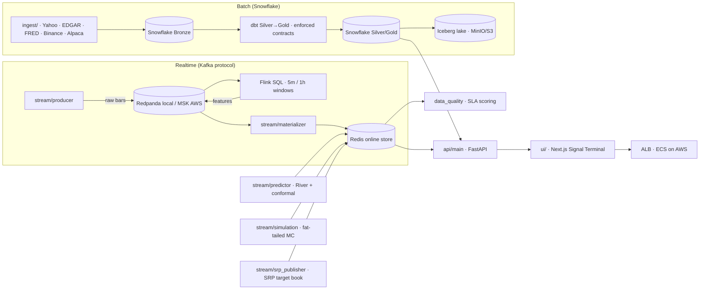

# Signal

A quant research platform that ends in a **live market-neutral book placing
real orders on a venue** — and, the part most platforms cannot demonstrate, a
**deploy gate proving the live system runs the strategy that was validated**.

| | |
|---|---|
| Research ⇄ production agreement | **0 mismatches / 4,480 checks** |
| Look-ahead leak, every factor | **0.00e+00** |
| Strategy Sharpe (112 perps, 363 weeks) | **2.16** (t = 5.03) |
| Alpha vs market/size/momentum | **27%/yr** (t = 4.42) |
| 2022 drawdown | market **−82.5%**, book **+9.4%** |

**Status:** running locally under Docker Compose; papers on SSRN and submitted to
the *Journal of Portfolio Management*. The AWS topology is Terraform-defined and
`validate`-checked in CI, but not applied to a live account.

---

## Architecture



**Batch** lands raw data in Snowflake, transforms bronze→silver→gold with dbt
under enforced column contracts, and versions the mart to an Iceberg lake.

**Realtime** is a replayable log: the producer publishes 1m bars, Flink windows
them, and the materializer is the only writer into Redis. Four services consume
the same feature topic at independent offsets, so adding a fifth changes nothing
upstream.

**Two strategies on two clocks** share one venue adapter — an hourly online
learner and a weekly factor book — each with its own execution engine and ledger.

→ [Architecture in depth](docs/realtime_architecture.md) — design decisions, failure
modes, and the outages that motivated them.

---

## Quick start

```bash
make stream-infra          # Redpanda + Redis + Flink
make stream-topics         # create topics (Flink needs them to exist)
make stream-producer       # venue bars → Kafka
make stream-materializer   # Kafka → Redis online store
make stream-srp            # score the weekly book → srp:weights:*
make stream-srp-execute    # trade it (paper; --venue bybit-demo for demo fills)
uvicorn api.main:app       # dashboard API on :8000
```

→ [Runbook](docs/RUNBOOK.md) — Snowflake bootstrap, Flink jobs, the data lake,
the promotion gate, AWS deployment, and how to reproduce every number above.

---

## Technology stack

| Concern | Tool |
|---|---|
| Config | `pydantic-settings` (env-driven, secrets masked) |
| Warehouse | Snowflake (`snowflake-connector-python`) |
| Transform + quality | `dbt-core` + `dbt-snowflake` (contracts, tests) |
| Statistical tests / observability | `dbt_expectations` · `elementary` |
| Stream broker | Redpanda (local) / Amazon MSK (AWS) — Kafka API, `confluent-kafka` |
| Stream processing | Flink SQL (`flink:1.19.3`), checkpointed event-time windows |
| Online store | Redis 7 (`redis-py`), bounded feature lists |
| Research / validation | MLflow tracking · River progressive validation |
| Data quality | `stream/data_quality.py` (Soda/Elementary-style) |
| Orchestration | Prefect |
| Distributed compute | Spark + `spark-snowflake` connector (pandas fallback runs without Java) |
| Runtime (AWS) | ECS Fargate · ECR · MSK · ElastiCache · S3 · CloudWatch + SNS — Terraform |
| UI | Next.js · ECharts / Recharts |

---

---

## Repository layout

```
quant_signal/
├── config/                  # pydantic-settings + structlog JSON logging
├── db/                      # Snowflake client, idempotent bootstrap, bootstrap.sql
├── ingest/                  # providers (Yahoo/EDGAR/FRED/Binance/Alpaca), store, quality
├── flows/                   # batch orchestration: ingest_*, feature_engineering, materialize
├── dbt/                     # dbt project: profiles, contracts, silver/gold models
├── stream/                  # realtime: producer, materializer, predictor, simulation,
│   │                        #   quality, research harness, watchdog, flink jobs
│   ├── feature_feed.py      #   REAL upstream for crypto.features.1h (replaces the dead river)
│   ├── intraday_feed.py     #   1h/5m bars -> daily factor inputs (same reducer as research)
│   ├── positioning_feed.py  #   keyless venue metrics REST (OI, long/short ratios)
│   ├── srp_live.py          #   live book: data plumbing ONLY, strategy logic never duplicated
│   ├── srp_publisher.py     #   scores the weekly book → srp:weights:* / srp:book
│   ├── srp_execution.py     #   trades that book on a WEEKLY clock (own ledger, own engine)
│   └── flink/               # Dockerfile + crypto_features.sql (5m/1h windows)
├── api/                     # FastAPI: /api/market/*, /pead, /fundamentals, /ws/market
├── ui/                      # Next.js Signal Terminal
├── infra/terraform/         # AWS IaC: modules + environments/dev (S3 backend, runbook)
├── tools/                   # one-off operational utilities (position cleanup, validators)
├── scripts/                 # thin CLIs: ping, run_dbt, run_research, run_quality, watchdog…
│   ├── backfill/            #   data acquisition CLIs (archive pulls, positioning, funding)
│   ├── probes/              #   exploratory / diagnostic scripts — NOT part of any pipeline
│   ├── srp_strategy.py      #   THE strategy — one pure function, shared by research + live
│   ├── factor_core.py       #   point-in-time primitives (xs_rank / ts_rank_pit) + leak_test
│   ├── srp_backtest.py      #   committed evaluator; every result is re-runnable
│   ├── srp_parity.py        #   DEPLOY GATE — non-zero exit on research/live divergence
│   ├── srp_sweep.py         #   executes the search space, logs every cell (incl. failures)
│   ├── trial_registry.py    #   append-only experiment log: config hash, Sharpe, git SHA
│   ├── srp_dsr.py           #   multiple-testing correction, inputs READ from the registry
│   ├── srp_walkforward.py   #   walk-forward + 7-anchor rebalance-timing-luck
│   └── srp_ablation.py      #   paired / best-of-grid / main-effects decomposition
├── tests/                   # hermetic tests — no live DB required
├── Dockerfile               # app image (agents + API)
├── docker-compose.yml       # redpanda + redis + flink-jobmanager/taskmanager
└── Makefile                 # setup / lint / test / bootstrap / dbt / api / ui / stream-*
```

---

---

## Continuous integration

`.github/workflows/quant-signal-ci.yml` runs on every PR/push:

- **lint + test** — `uv sync --frozen` + `ruff check .` + `pytest`
- **strategy gate** — `pytest tests/test_srp_parity.py`, run as its own step so a
  failure is legible in the checks list rather than buried in a summary. It
  asserts point-in-time integrity (a score recomputed with future rows deleted
  must match exactly), determinism, dollar-neutrality and non-emptiness against
  synthetic fixtures — the same properties `scripts/srp_parity.py` asserts
  against the real 27 MB cache, which is too large to ship in the repo
- **dbt contract checks** — `dbt parse` and (when Snowflake secrets exist) a
  full `dbt build --target ci` that only touches `CI_*` schemas
- **IaC sanity** — `terraform fmt -check` + `terraform validate` on every
  module and the dev environment (no AWS credentials required)

---

---

## Design principles

- **Nothing hardcoded.** All config via `pydantic-settings` from env vars;
  secrets use `Field(repr=False)`, dbt's `DBT_ENV_SECRET_*` prefix, and every
  query carries a `query_tag` for credit/cost attribution.
- **Fail fast.** Misconfiguration raises `ValidationError` at startup — it
  never silently half-runs.
- **Reproducible infra.** `make bootstrap` is idempotent; Terraform state is
  remote with locking.
- **Quality as contract.** Every silver/gold dbt model declares a full column
  contract or the build fails; runtime data quality is scored per window.
- **Honesty over polish.** Warm-up states are reported as such; a model that
  fails the promotion gate stays off — that's the intended behavior.
- **Structured logs.** JSON lines via `structlog`; secrets never logged.
- **Point-in-time or it does not ship.** Every factor input is leak-tested by
  recomputing a historical value with future rows deleted and requiring an exact
  match. A cross-sectional rank and a trailing time-series rank are *different
  primitives* and are never interchangeable — conflating them is how this project
  read the future for months without noticing.
- **Measured, not remembered.** Any statistic describing a *search* (how many
  configurations were tried, how much they varied) is read from an append-only
  log written by the code that ran them. A number a researcher recalls is not
  evidence, and the numbers most likely to be wrong are the flattering ones.
- **A silent pipeline is a failing pipeline.** Emptiness is asserted against,
  not assumed benign: liveness is checked against a wall clock, and a book that
  is flat everywhere fails the gate instead of passing it quietly.
- **Fail closed on missing data.** A symbol missing any required input is
  excluded from the cross-section, never imputed. A missed trade costs nothing;
  a fabricated one costs money.

---
