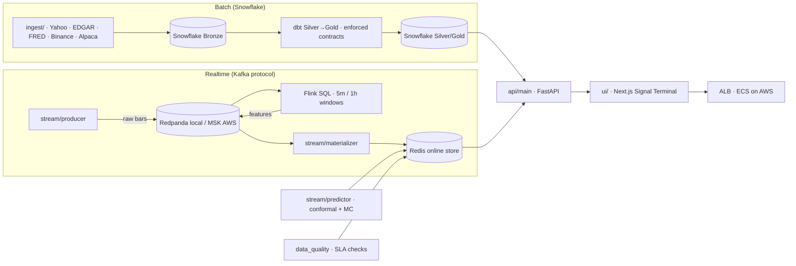

# quant_signal

Production-grade quant signal platform — **Snowflake-backed batch pipelines**,
a **Kafka → Flink → Redis realtime layer**, research-driven model validation,
and data quality enforced at every stage. Designed like the data platforms of
quant research houses (Two Sigma / Man AHL patterns).

**Status:** full build, running locally and deployed to AWS via Terraform.

---

## Table of contents

1. [Build log](#build-log)
2. [Architecture](#architecture)
3. [Key capabilities](#key-capabilities)
4. [Technology stack](#technology-stack)
5. [Repository layout](#repository-layout)
6. [Getting started](#getting-started)
7. [Local runbook](#local-runbook)
8. [AWS deployment](#aws-deployment)
9. [Continuous integration](#continuous-integration)
10. [Design principles](#design-principles)
11. [Notes & references](#notes--references)

---

## Build log

| Build | What | Delivered |
|---|---|---|
| **#1** | Autonomous research harness | Offline config sweep → MLflow → per-symbol leaderboards in Redis, read by the live predictor (`stream/research_harness.py`, `make stream-research`) |
| **#2** | Data quality / SLA layer | 8 quality dimensions + lineage manifest per window, served at `/api/market/quality` (`stream/data_quality.py`, `make stream-quality`) |
| **#3** | AWS IaC + CI + docs | MSK → Flink-on-Fargate → ElastiCache → ECS agents + UI behind an ALB; CloudWatch alarms + SNS; remote state; CI with `terraform fmt`/`validate` |

Every credential and threshold comes from the environment — nothing hardcoded.

---

## Architecture



The realtime feature pipeline, end to end:

```
Binance producer → Redpanda (crypto.bars.raw) → Flink SQL 5m/1h TUMBLE windows
   → Redpanda (crypto.features.*) → materializer → Redis online store → /api/market/*
```

The API reads from Redis (<500 ms, never touching Kafka or Snowflake); a stream
watchdog auto-heals a stalled Flink pipeline and a pipeline-health strip keeps
the dashboard honest about what is actually fresh.

---

## Key capabilities

- **Batch (Snowflake).** Idempotent bootstrap (database, warehouse, schemas,
  least-privilege roles), real ingestion (Yahoo / SEC EDGAR / FRED / Binance /
  Alpaca) into Bronze→Silver→Gold with latency telemetry, and dbt with
  enforced column contracts (`make bootstrap`, `make dbt-run`).
- **Realtime.** Redpanda (Kafka API) → Flink SQL event-time windows → Redis
  online store; the same broker protocol runs on AWS MSK.
- **Online prediction.** River online learner with conformal intervals + Monte
  Carlo simulation; a **promotion gate** (progressive validation + Deflated
  Sharpe) decides honestly whether a model may trade.
- **Research harness.** Hyperparameters are swept, tracked to MLflow, and
  leaderboarded — not guessed.
- **Data quality.** 8 dimensions + lineage, scored per symbol/window and served
  over the API.
- **Observability.** Per-stage freshness, self-healing watchdog, and (on AWS)
  CloudWatch alarms + SNS + a platform dashboard.
- **Signal Terminal.** Next.js dashboard rendering the full MC visualization
  stack (forward fan, equity fan, pass-probability landscape, drawdown/terminal
  distributions).

---

## Technology stack

| Concern | Tool |
|---|---|
| Config | `pydantic-settings` (env-driven, secrets masked) |
| Warehouse | Snowflake (`snowflake-connector-python`) |
| Transform + quality | `dbt-core` + `dbt-snowflake` (contracts, tests) |
| Statistical tests / observability | `dbt_expectations` · `elementary` |
| Stream broker | Redpanda (local) / Amazon MSK (AWS) — Kafka API, `confluent-kafka` |
| Stream processing | Flink SQL (`flink:1.19.3`), checkpointed event-time windows |
| Online store | Redis 7 (`redis-py`), bounded feature lists |
| Research / validation | MLflow tracking · River progressive validation |
| Data quality | `stream/data_quality.py` (Soda/Elementary-style) |
| Orchestration | Prefect |
| Distributed compute | Spark + `spark-snowflake` connector (pandas fallback runs without Java) |
| Runtime (AWS) | ECS Fargate · ECR · MSK · ElastiCache · S3 · CloudWatch + SNS — Terraform |
| UI | Next.js · ECharts / Recharts |

---

## Repository layout

```
quant_signal/
├── config/                  # pydantic-settings + structlog JSON logging
├── db/                      # Snowflake client, idempotent bootstrap, bootstrap.sql
├── ingest/                  # providers (Yahoo/EDGAR/FRED/Binance/Alpaca), store, quality
├── flows/                   # batch orchestration: ingest_*, feature_engineering, materialize
├── dbt/                     # dbt project: profiles, contracts, silver/gold models
├── stream/                  # realtime: producer, materializer, predictor, simulation,
│   │                        #   quality, research harness, watchdog, flink jobs
│   └── flink/               # Dockerfile + crypto_features.sql (5m/1h windows)
├── api/                     # FastAPI: /api/market/*, /pead, /fundamentals, /ws/market
├── ui/                      # Next.js Signal Terminal
├── infra/terraform/         # AWS IaC: modules + environments/dev (S3 backend, runbook)
├── scripts/                 # thin CLIs: ping, run_dbt, run_research, run_quality, watchdog…
├── tests/                   # hermetic tests — no live DB required
├── Dockerfile               # app image (agents + API)
├── docker-compose.yml       # redpanda + redis + flink-jobmanager/taskmanager
└── Makefile                 # setup / lint / test / bootstrap / dbt / api / ui / stream-*
```

---

## Getting started

**Prerequisites:** Python 3.11+ with `uv`, Docker (for the streaming stack),
and a free Snowflake trial account (`signup.snowflake.com`, $400 credits).

```bash
cd quant_signal
make setup        # uv sync (runtime + dev deps)
make dbt-setup    # uv sync (adds dbt-core + adapter)
make check        # ruff + pytest — no Snowflake needed
```

### Snowflake bootstrap (one-time)

1. In Snowsight create a warehouse `QUANT_WH` (XS, auto-suspend 60s).
2. Copy `.env.example` → `.env` and fill in the `SNOWFLAKE_*` and `DBT_*`
   variables.
3. Bootstrap and verify:

```bash
make bootstrap    # idempotent: DB, warehouse, schemas, least-privilege roles
make ping         # SELECT 1 over the live connection
make dbt-debug    # verify the dbt connection
make dbt-deps     # install dbt_expectations + elementary
make dbt-run      # build silver/gold with enforced contracts + tests
```

### Using the client

```python
from db.snowflake import SnowflakeClient

client = SnowflakeClient()
print(client.ping())                           # True once connected
df = client.query_df("SELECT 1 AS one")
client.insert_df(df, table_name="my_table")    # appends into QUANT.BRONZE
```

---

## Local runbook

### Dashboard + live market stream

```bash
make api   # FastAPI on :8000 (needs .env; MFA passcode via env or prompt)
make ui    # Next.js on :3000 — proxies /api/* to :8000, same-origin
```

Open `http://localhost:3000`. Direct API calls:

```bash
curl localhost:8000/api/pead
curl localhost:8000/api/market/AAPL?days=750
curl localhost:8000/api/fundamentals/AAPL
curl localhost:8000/api/metrics/pipeline
curl localhost:8000/api/market/live/BTCUSDT          # live bars (from Kafka)
curl localhost:8000/api/market/features/BTCUSDT      # 5m features (from Redis)
curl localhost:8000/api/market/gate/BTCUSDT          # promotion-gate verdict
curl localhost:8000/api/market/quality               # data quality + lineage
curl localhost:8000/api/market/research/BTCUSDT      # research leaderboard
```

Live WebSocket: `wscat -c 'ws://localhost:8000/ws/market?symbol=BTCUSDT'`.
The stream is on by default; set `STREAM_ENABLED=false` for a pure query API.

### Streaming stack (Kafka → Flink → Redis)

```bash
make stream-infra            # docker compose up -d --build (redpanda, redis, flink)
make stream-topics           # create Kafka topics (Flink requires them to exist)
make stream-flink-submit     # deploy crypto_features.sql (5m windows, detached)
make stream-flink-submit-1h  # deploy crypto_features_1h.sql (1h windows)
make stream-flink-status     # expect RUNNING
```

Then, in two terminals:

```bash
make stream-producer         # poll Binance → publish raw bars (real market data)
make stream-materializer     # consume raw + features → Redis
```

For a fast end-to-end check without Binance, seed synthetic bars:
`make stream-seed` (the Flink window fires within ~2 minutes).

> **Notes.** Topics must exist before the Flink job starts. Redis maps to host
> **:6380** (`STREAM_REDIS_URL=redis://localhost:6380`). The Flink image pins
> the Kafka connector JAR with correct ownership and a writable checkpoint dir,
> or the job restarts with `ClassNotFoundException` / `IOException`.

### Research harness (Build #1)

Sweep the predictor's config grid offline against the same learn-then-predict
loop the live model uses; every run is tracked to MLflow and per-symbol
leaderboards land in Redis.

```bash
make stream-research
curl localhost:8000/api/market/research/BTCUSDT
```

While the grid is cold the leaderboard honestly reports `winner: None`.

### Data quality / SLA (Build #2)

Score the online store across **8 dimensions** (freshness, latency, volume
coverage, completeness, ordering, schema, value sanity, duplicate-free) with a
per-window **lineage manifest**, so a degraded number is traceable to the
source that caused it.

```bash
make stream-quality
curl localhost:8000/api/market/quality
```

Warm-up is reported honestly — a fresh 1h pipeline shows volume `critical`,
never silently ignored.

### Prediction promotion gate

Before the live predictor may emit LONG/SHORT, `stream/predictive_eval.py`
replays its exact learn-then-predict loop over stored feature history and
checks: progressive validation, transaction-cost-adjusted P&L, IC / direction
accuracy vs naive baselines, conformal coverage, block stability, and
**Deflated Sharpe** (corrected for multiple testing). A model may learn but not
trade until `passes_gate()` clears everything:

```bash
curl localhost:8000/api/market/validation/BTCUSDT?track=true   # → MLflow
curl localhost:8000/api/market/gate/BTCUSDT
```

### Pipeline health + watchdog

- `GET /api/market/health/summary` → per-stage freshness (produce / features /
  predict / simulate / strategy) rendered as a 6-stage LED strip.
- `scripts/stream_watchdog.py` restarts a stalled Flink job with `--fix`:

```bash
make stream-watchdog          # or: python -m scripts.stream_watchdog --interval 60 --fix
```

---

## AWS deployment

The same platform as managed infrastructure in `infra/terraform/`:
**MSK** (managed Kafka) → **Flink on Fargate** → **S3 checkpoints** →
**ElastiCache Redis** → ECS agents + Next.js UI behind an **ALB**, with
CloudWatch alarms + SNS + a platform dashboard.

Highlights (research-backed): Service Connect for in-cluster DNS, task-role-only
credentials (Bybit demo keys via Secrets Manager — never env or logs), and a
3-broker MSK cluster as the Kafka durability floor.

```
infra/terraform/
├── modules/            networking · storage · msk · iam · ecr · ecs · observability
└── environments/dev/   S3 backend + DynamoDB lock, module wiring, outputs
```

```bash
cd infra/terraform/environments/dev
terraform init          # configures the S3 backend
terraform plan
terraform apply
```

**Full runbook** (backend bootstrap, secrets, Flink job submission via
`ecs exec`): [`infra/terraform/README.md`](infra/terraform/README.md).

---

## Continuous integration

`.github/workflows/quant-signal-ci.yml` runs on every PR/push:

- **lint + test** — `uv sync --frozen` + `ruff check .` + `pytest`
- **dbt contract checks** — `dbt parse` and (when Snowflake secrets exist) a
  full `dbt build --target ci` that only touches `CI_*` schemas
- **IaC sanity** — `terraform fmt -check` + `terraform validate` on every
  module and the dev environment (no AWS credentials required)

---

## Design principles

- **Nothing hardcoded.** All config via `pydantic-settings` from env vars;
  secrets use `Field(repr=False)`, dbt's `DBT_ENV_SECRET_*` prefix, and every
  query carries a `query_tag` for credit/cost attribution.
- **Fail fast.** Misconfiguration raises `ValidationError` at startup — it
  never silently half-runs.
- **Reproducible infra.** `make bootstrap` is idempotent; Terraform state is
  remote with locking.
- **Quality as contract.** Every silver/gold dbt model declares a full column
  contract or the build fails; runtime data quality is scored per window.
- **Honesty over polish.** Warm-up states are reported as such; a model that
  fails the promotion gate stays off — that's the intended behavior.
- **Structured logs.** JSON lines via `structlog`; secrets never logged.

---

## Notes & references

- **Snowflake auth.** No API key. Password (with MFA via `username_password_mfa`
  + Duo push) or RSA key-pair (`SNOWFLAKE_PRIVATE_KEY_FILE`). Prefer key-pair
  for non-interactive automation. `ALLOW_CLIENT_MFA_CACHING` caches the MFA
  token ~4h.
- **Spark → Snowflake.** The `spark-snowflake` connector has no native stream
  sink — write via `foreachBatch`. Keep the warehouse small + auto-suspend.
- **Design literature.** Model validation and platform posture follow Gu,
  Kelly & Xiu (2020) on the weakness of single-asset return prediction;
  López de Prado on overfitting/backtesting; Bailey & López de Prado on
  Deflated Sharpe; and Two Sigma / Man AHL–style data-platform patterns.
